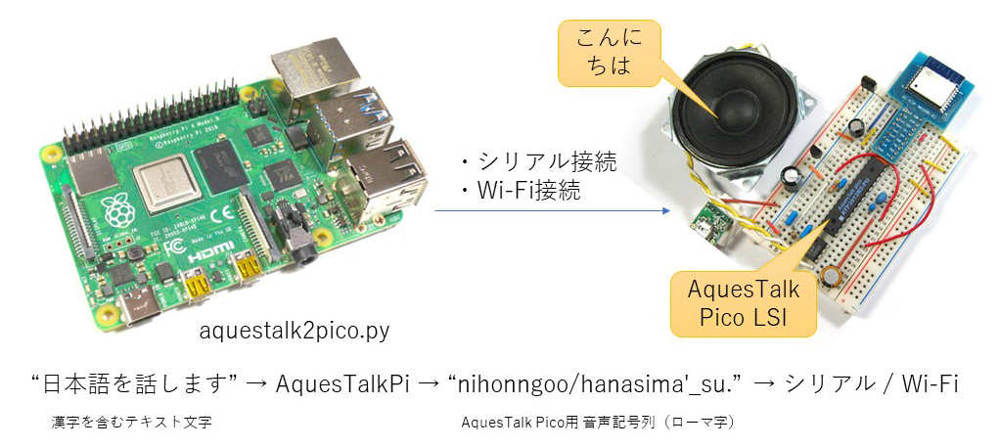

# aquestalkpi2pico
「日本語を話します」のような漢字交じりの日本語から、「nihonngoo/hanasima'_su.」のような音声記号列（ローマ字）に変換し、USBシリアルまたはWi-Fiを使ってAquesTalk Pico LSIに転送するプログラムです。  
音声記号列への変換は、㈱アクエストの AquesTalkPi に含まれる言語処理エンジン AqKanji2Koe を利用しました。

## 特長

- 漢字交じりの日本語を変換して AquesTalk Pico LSI に転送します  
- Raspberry Pi のUSBに接続したUSBシリアル変換アダプタ経由で転送します  
- Wi-Fi接続によるHTTP通信で転送することも出来ます  

## 対応デバイス

- AquesTalk Pico LSI (アクエスト製・秋月電子通商などで販売されている)  
- Wi-Fi コンシェルジェ アナウンス担当（CQ出版 超特急Web接続! ESPマイコン・プログラム集 P.135）

## ライセンスに関する注意点

本ソフトウェアを使用するには、別途、株式会社アクエストの AquesTalkPi をダウンロードする必要があります。個人が非営利で使用する場合に限り無料で利用できますが、個人利用であっても個人事業、会社や大学での使用する場合はライセンスの購入が必要です。必ず、下記をご覧ください。  

	AquesTalk Pi（株式会社アクエスト）  
	https://www.a-quest.com/products/aquestalkpi.html  

AquesTalk、AquesTalkPi、AqKanji2Koe、AquesTalk Pico LSIの名称やソフトウェアの権利は、株式会社アクエストに帰属します。  
このドキュメントおよびレポジトリaquestalkpi2pico内のプログラムの権利は国野亘に帰属します。  
Copyright (c) 2021 Wataru KUNINO

## セットアップ方法

自動セットアップ・ツールも準備しました。上記のライセンスを確認したうえで、下記のコマンドを実行してください。  

	(当方製作 aquestalkpi2pico をダウンロード)  
	pi@raspberrypi:~ $ `git clone https://bokunimo.net/git/aquestalkpi2pico` ⏎  
	
	(株式会社アクエスト製AquesTalkPiをダウンロード)  
	pi@raspberrypi:~ $ `cd aquestalkpi2pico` ⏎  
	pi@raspberrypi:~/aquestalkpi2pico $ `./aquestalkSetup.sh` ⏎  
	AquesTalkのウェブサイトにアクセスして、ライセンスを確認してください。  
	http://www.a-quest.com/products/aquestalkpi.html  
	上記のライセンスに同意する場合は「yes」を入力してください。  
	yes/no > `yes` ⏎  

ダウンロードが完了すると、再生テストが開始されます。  

## 実行方法

./aquestalk2pico.py と空白1文字に続けて日本語を入力し、Enterで入力した日本語を話します。
下図は実行例です。音声記号列「nihonngoo/nyu-ryo_kusuru'to/hanasima'_su.」が得られました。

	pi@raspberrypi:~/aquestalkpi2pico $ `./aquestalk2pico.py 日本語を入力すると話します` ⏎  
	Usage: ./aquestalk2pico.py 日本語を入力  
	MAINPRO1, 開始  
	subprocess = aquestalkpi/AquesTalkPi 日本語を入力すると話します | /usr/bin/aplay  
	再生中 WAVE 'stdin' : Signed 16 bit Little Endian, レート 8000 Hz, モノラル  
	MAINPRO1, 終了  
	MAINPRO2, 開始  
	subprocess = aquestalkpi/AquesTalkPi -t 日本語を入力すると話します|./aquestalk2pico.py SUBPROCESS  
	Usage: ./aquestalk2pico.py 日本語を入力  
	SUBPRO, this subprocess is called by a script  
	ニホンゴオ/ニューリョ_クスル'ト/ハナシマ'_ス。  
	nihonngoo/nyu-ryo_kusuru'to/hanasima'_su.  
	200  
	MAINPRO2, 終了  

シリアル・ポートやWi-Fiに送信するには、aquestalk2pico.pyの下記の部分を書き換えます。  

	(初期値)
	# AquesTalk Pico を接続したシリアル・ポートを下記に設定して下さい。  
	tty = ''  
	# IP接続に対応した AquesTalk Pico があれば、下記に設定して下さい。 
	aques_ip = list()  
	
	(設定例)  
	# AquesTalk Pico を接続したシリアル・ポートを下記に設定して下さい。  
	tty = '/dev/ttyUSB0'  
	# IP接続に対応した AquesTalk Pico があれば、下記に設定して下さい。  
	aques_ip = ['192.168.1.1']  

シリアル・ポート名が分からないときは、以下のコマンドで確認します。ttyUSB0 や ttyACM0 といったポート名が表示されるので、 /dev/ttyUSB0 や /dev/ttyACM0 を上記プログラム中(設定例)の変数ttyに代入してください。  

	$ `dmesg | grep tty` ⏎  
	[    8.535414] usb 1-1.2: FTDI USB Serial Device converter now attached to ttyUSB0  

## 既知の制約事項

- Wi-Fi コンシェルジェ アナウンス担当 が受信可能な文字数制限により 50文字を超える音声記号列が送れません。長文を話したいときは、半角スペースを入れ、送信を分けてください。「日本語を入力すると話します 空白で、長文を分けることも出来ます 長い文章の場合は、適宜分けてください」

by bokunimo.net(https://bokunimo.net/)  
